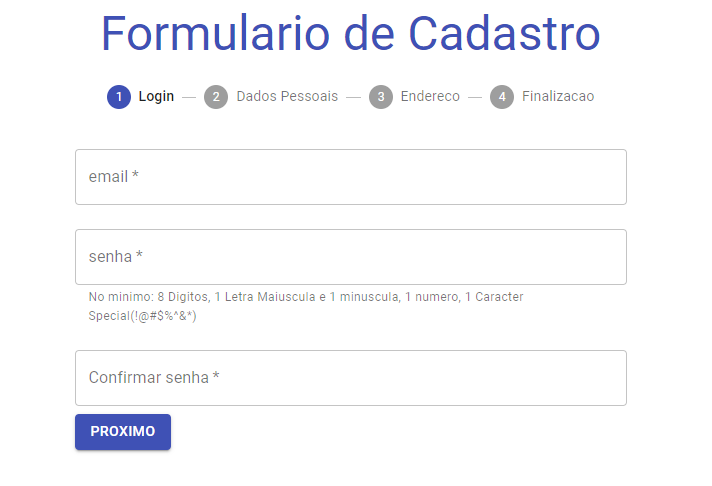
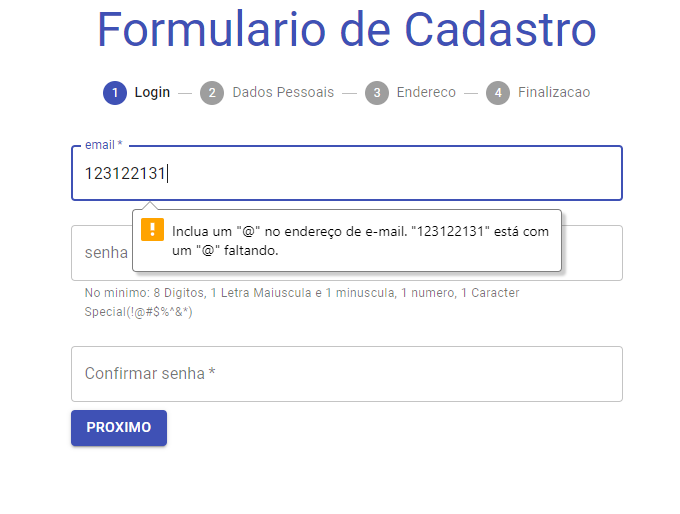
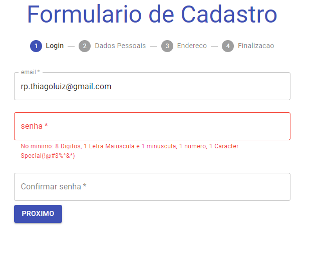
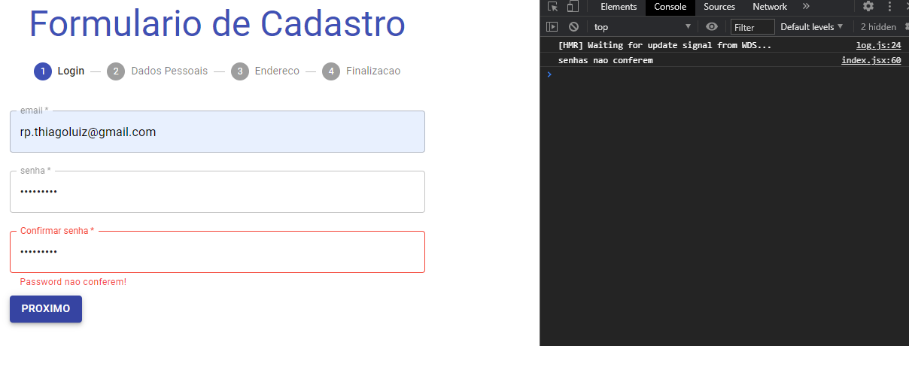
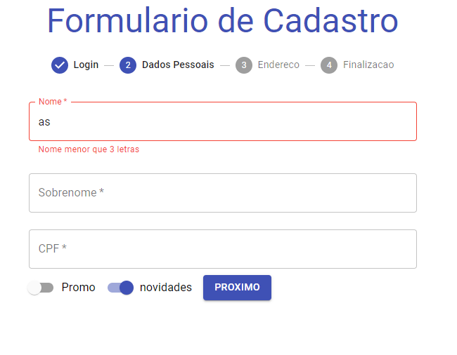
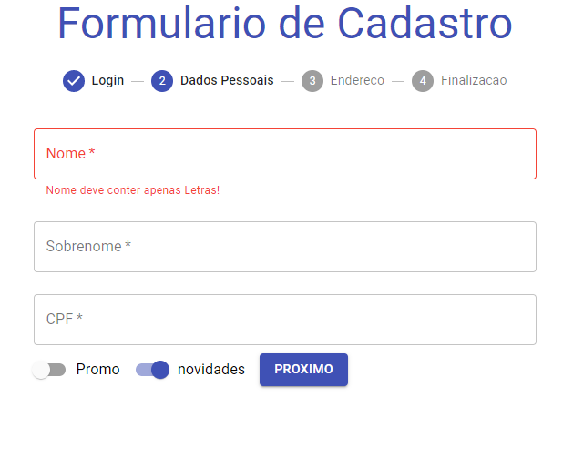
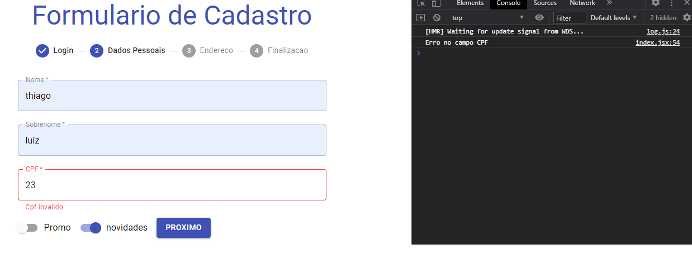
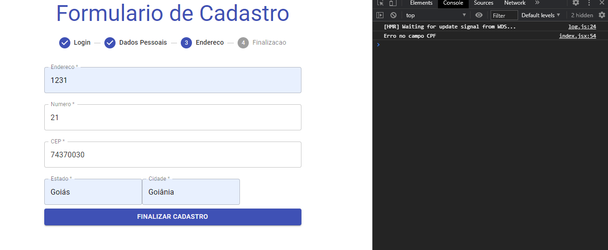
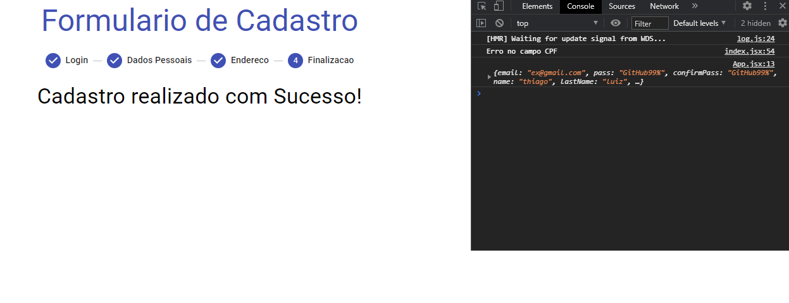

# pt-br

Ola,
   Formulario controlado em etapas feito com REACT, material-ui.
   As etapas vao sendo liberadas conforme o usuario for preenchendo o formulario. 
    Controle de etapas e feito, para que nao a haja como ele passar para a proxima sem preencher os dados, alguns controles sao proprios do html, a maioria foi criado em JS para impedir dados falsos.

# en-us

Hello,
   This is a validation form, witch steps. I use React and material-ui for build it. 
   The steps are being released according to the user to fill out the form.
     Control of steps is done, so that there is no way to pass it to the next one without filling in the data, some controls are own of the html, most were created in JS to prevent false data.

### Updates.
[ ] Modal Error!

[DevThiago](https://devthiagoluiz.com.br/)
